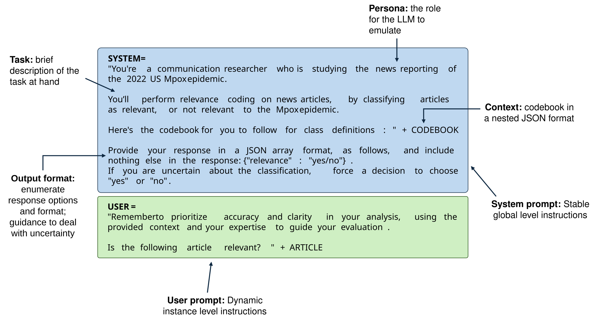

For each project below, first, I will motivate the problem that we're aiming to solve, with a premise and a question. Second, I'll provide illustrations and an abstract to summarize the study. Third, I'll provide articles, extended abstracts and/or talk slides that I've submitted to conferences where I have or will present this work. Feel free to reach out to me regarding any of them to know more. Datasets and code for most of them will be available upon journal publication. 

## Published work

<h3 style = "text-align: left;"> Link updating strategies influence consensus decisions as a function of the direction of communication </h3>

<a href="https://doi.org/10.1098/rsos.230215">Article</a> | <a href="https://doi.org/10.5281/zenodo.7937057">Code</a> 

<b>Collaborators:</b> <a href = "https://www.cocomo.group">Ariana Strandburg-Peshkin</a>, <a href = "https://scholar.google.de/citations?user=ohjpTJUAAAAJ&hl=de">Helge Giese</a>, <a href = "https://pminasandra.github.io">Pranav Minasandra</a>, <a href = "https://sumantrasarkarlab.org.in">Sumantra Sarkar</a>, <a href = "https://be.iisc.ac.in/~mkjolly/mohit/">Mohit Kumar Jolly</a>, <a href = "https://scholar.google.de/citations?user=FHe7hjAAAAAJ&hl=de">Nico Gradwohl</a>.

Click to know more

<i> Imagine playing a game where you're supposed to convince others to adopt your opinion/viewpoint. If you speak only with others who agree with you, you're not convincing anybody who needs convincing, but if you're speaking only with others who disagree, they might end up changing your mind. What do you do? </i>

In an age characterized by unprecedented access to information through online social networks, understanding how collective opinions are influenced by users choosing their communication partners is essential to disentangle the mechanisms of polarization and deadlocks. Importantly, the direction of user choice is context dependent: for example, on Twitter, users choose who they receive information from while following public accounts but choose who they send information to while setting Twitter circles. Similarly, on YouTube, users choose who they receive content from when they subscribe to a channel, but creators choose who to send content to while targeting video campaigns. 

Here, we study how the autonomy that users have in manipulating their communication networks interacts with collective opinions. Using numerical simulations, we show that consensus decisions can be biased by users avoiding disagreeing others (e.g. homophily) as a function of whether they send or receive information. Avoiding disagreeing others assorts users into like-minded clusters, and such clusters facilitate consensus outcomes in favour of users who either retain disagreeing links while sending information or break disagreeing links while receiving information. Besides highlighting the importance of context-specific effects of user link selection, we show boundary conditions under which these effects matter. These findings shed light on the importance of considering how user choice interacts with communication networks when informing interventions against structural polarization in media.

<h3 style = "text-align: left;"> Computational frame analysis revisited: on LLMs for studying news coverage </h3>

<a href="https://arxiv.org/abs/2511.17746">Preprint</a> | <a href="https://github.com/sharajk/computational-framing">Code</a> 

<b> Collaborators: </b> <a href = "https://scarpino.github.io">Samuel Scarpino</a>, <a href = "http://brooke-welles.squarespace.com">Brooke Foucault Welles</a>, <a href = "https://www.linkedin.com/in/rushali-mohbe/">Rushali Mohbe</a>, <a href = "https://www.linkedin.com/in/tyler-reese-mckenzie-/">Tyler Mckenzie</a>, <a href = "https://asmithh.github.io">Alyssa Smith</a>.

Click to know more

<i> Everybody's talking about how great large language models such as ChatGPT are at analysing and summarizing documents. Computational media scholars are often tasked with interpreting and monitoring online discourse. How could LLMs help their analytical workflow? </i>

The rise of advanced AI language models like GPT and Claude has created new opportunities for analyzing media content, but it remains unclear whether these tools actually improve upon existing methods. We evaluated how well these generative models identify frames in news coverage compared to simpler computational approaches and traditional human coding. Our evaluation used a carefully constructed dataset of news articles about the 2022 US Mpox epidemic, which we analyzed over a six-month period.

Our findings show that these powerful AI models do not universally outperform older methods. Human coders were consistently more accurate, and in some cases, simpler language models worked better than the more advanced ones. Importantly, we found that different methods excelled at different parts of the analysis process, depending on what the specific task required. Rather than replacing one method with another, our results suggest that researchers benefit most from using multiple approaches together—combining human oversight with various computational tools based on what each does best. This study offers practical guidance for researchers looking to incorporate AI into frame analysis while recognizing the continued importance of human judgment and simpler computational alternatives.

----

## Works in progress

<h3 style = "text-align: left;"> Characterizing the politicized news media framing of the U.S. Mpox epidemic of 2022 </h3>

<a href="../files/ic2s2_2024.pdf">Extended Abstract</a> | <a href="../files/ic2s2_2024.pptx">IC2S2 2024 talk </a> 

<b> Collaborators: </b> <a href = "https://scarpino.github.io">Samuel Scarpino</a>, <a href = "http://brooke-welles.squarespace.com">Brooke Foucault Welles</a>, <a href = "https://www.linkedin.com/in/rushali-mohbe/">Rushali Mohbe</a>.

Click to know more

<i> Historically, mass media's coverage of queer people's health has been heavily politicized and riddled with homophobic rhetoric. Literature on how the AIDS epidemic was covered reveals various stigmatizing narratives that blame individuals for disease spread. Now that we're 4 decades in, do we see any difference in how queer health is talked about? </i>

Mass media plays a central role in framing political discourse surrounding health issues. On one hand, media frames can shape public attitudes towards the issue. For example, framing masking against COVID-19 as an altruistic endeavor to protect others may garner support, whereas framing it as an intrusion of personal liberty may garner opposition towards mask mandates. On the other hand, media frames are shaped by prior perceptions of related issues, and can be ideologically motivated. Crucially, when media coverage of health issues are politicized, i.e., driven by partisan interests as opposed to scientific facts, individuals increasingly rely on political elites for information, thus undermining public health efforts. 

In 2022, the United States was struck with an epidemic of Mpox, a disease that was endemic to western and central Africa prior to this outbreak. This epidemic disproportionately affected Sexual and Gender Minorities (SGMs) of color, thus marking a discourse with starkly politicized frames at the intersections of issues concerning queerness, race, health, global relations and partisan politics. Through a frame analysis on the news coverage, we reveal various competing problem definitions, causal interpretations, moral evaluations and treatment recommendations made with respect to the epidemic. 

<h3 style = "text-align: left;"> A Network analysis of Intermedia Frame-building in the News discourse about the Mpox epidemic </h3>

<a href="../files/Intermedia_frame-building.pdf">Extended Abstract</a> | <a href="../files/NetSciX-25_Kunjar.pptx">NetSciX 2025 talk</a> 

<b> Collaborators: </b> <a href = "https://scarpino.github.io">Samuel Scarpino</a>, <a href = "http://brooke-welles.squarespace.com">Brooke Foucault Welles</a>.

Click to know more

<i> We know that partisan affiliations of a news outlet shapes their reporting. When an issue is controversial and there are competing viewpoints based on partisanship, how do news outlets affect each others' reporting? If NPR were to say something, would it be because New York Times said the same thing, or was it because Fox News said the opposite thing, and now NPR is compelled to rebut? </i>

The Intermedia Frame-Building hypothesis posits that given an agenda, framing choices of different media outlets are influenced by each other. For example, if Fox news talks about Mpox by placing an emphasis on the sexual nature of transmission, NPR would follow up with their own views on the sexual nature of transmission of Mpox. We represent this phenomenon as a network problem, with news outlets as the nodes, and intermedia influence as the edges. First, we focus on news frames surrounding sexuality and Mpox, obtained from the aforementioned analysis. While right-leaning news articles overwhelmingly stigmatized Sexual and Gender Minorities (SGMs) and preached abstinence, left-leaning articles offered competing frames, highlighting the need for sex-positive and queer affirmative approaches. Second, we derive time series data signifying the number of published articles by each outlet that feature these frames. Third, we infer a network of influence between outlets using the time series data. The network inference is done using a combination of Transfer Entropy and Bayesian structure learning in R. Thus, we have an intermedia influence network. 

Surprisingly, we find that alt-right news outlets such as Breitbart and Daily Caller were the central agenda setters for this discourse. In other words, left-leaning news outlets such as NPR and New York Times were influenced by each way other lesser than they were influenced by right-leaning outlets. Essentially, while alt-right outlets may have set the stage for controversies surrounding Mpox being a "gay disease", left-leaning outlets amplified this controversy by being reactive. It is important to note that these intermedia influence patterns seem to be unique to controversial and competitive news frames, since we don't find similar patterns for frames with reasonable bipartisan consensus (such as critiques about the CDC's slow response and vaccine disparities). 

<h3 style = "text-align: left;"> Order in Chorus: Studying group decision-making in meerkats using move call dynamics </h3>

<b> Collaborators: </b> <a href = "https://www.cocomo.group">Ariana Strandburg-Peshkin</a>, <a href = "https://lilyjohnsonulrich.weebly.com">Lily Johnson-Ulrich</a>, <a href = "https://www.ab.mpg.de/person/103465/2736">Vlad Demartsev</a>.

Click to know more

<i>
Growing up, I'd often have to convince my parents to take me out for lunch. It'd start with me yelling that I want to have restaurant soup and kebabs. 1 out of 5 times, my mom would back me up. When she did, my dad (the one who'd pay for the lunch) was more likely to agree to take us out. This decision was a group one: I'd initiate the idea, my mom would amplify my idea, and my dad my finalize the decision. So even though the decision was a consensus one, we all played different roles in the process. What if animals did something similar? What if there are special roles that different members of a group assume when they decide to go out for food, i.e., forage?
</i>

<i> Illustration credits: Pranav Minasandra </i> 

Animals in the wild routinely engage in group decision-making, be it primates deciding where to rest, birds deciding where to forage, or bees deciding where to nest. Conventional analysis of these decision-making processes either assume that all individuals in the group contribute equally (shared decision-making), or that some individuals lead and others follow (unshared decision-making). We challenge this dichotomy by introducing a form of shared decision-making where each individual contributes by specializing in unique roles during the process. Here, we investigate quorum decision-making in two groups of foraging meerkats by using the move-call vocalization dynamics as a case study. We derive time series data for the move calls by labelling audio signals obtained through collaring meerkats at the Kalahari Research Centre. In meerkat groups, move calls facilitate movement between foraging patches. Prior literature suggests that move calls result in successful movement bouts only when atleast 3 individuals participate in the move call chorus. We propose a framework where these bouts occur in 3 steps: An initiation (where an individual makes the first move call), an amplification (where another individual makes the second move call) and a finalization (where yet another individual makes a third call). We show that individuals tend to specialize in these roles based on their social status: Sub-ordinate adults tend to initiate, juveniles tend to amplify, and the dominant female tends to finalize successful move call bouts. 

